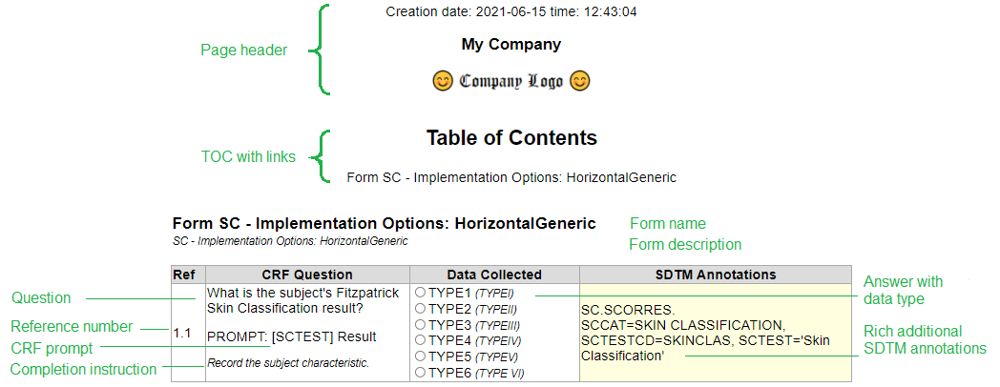

# CRF 실행 <a name="CRF_Renditions"/>
style-sheet가 ODM-xml 문서에서 브라우저의 CRF 페이지를 생성하는 방법에 대한 간단한 설명입니다.

## CRF layout <a name="CRF_layout"/>
여기에 제시된 CRF 레이아웃의 주요 기능은 각 질문 라인의 인접한 열에 SDTM 주석을 배치하는 것입니다.
이렇게 하면 주석 상자를 CRF 요소의 내부와 상단으로 이동할 필요 없이 SDTM 주석이 적절한 위치에 표시됩니다.
이것이 CRF 양식 너비에서 약간의 공간을 차지하더라도
[acrf](/examples/acrf.pdf)는 SDTM 주석의 문서이고 [bcrf](/examples/bcrf.pdf)는 CRF 페이지 자체의 문서입니다.
이 분할은 또한 보다 풍부한 SDTM 주석을 위한 공간을 허용합니다.

CRF 변환은 **FormDef** 태그로 식별되는 CRF의 각 양식에 대한 하나의 테이블로 구성되며 아래 열이 있습니다.

1. ODM-xml 파일에 있는 **ItemGroupRef** 및 **ItemRef** 태그의 **@OrderNumber** 속성에서 구성된 시퀀스 번호입니다. 이 번호는 CRF 콘텐츠를 논의하고 검토할 때 사람이 참조하는 역할을 할 뿐만 아니라 CRF 요소의 정렬을 추적합니다. 양식 또는 질문에 구현 참고 사항이 있는 경우 번호 옆에 해시 기호(**#**)가 표시되고 실제 참고 사항은 CRF 페이지 뒤 각주에 번호를 참조하여 표시됩니다.
2. **Question/TranslatedText** 태그로 식별된 CRF 양식의 질문입니다. **Alias[@Context='completionInstructions']/@Name** 태그의 모든 완료 지침은 질문과 함께 표시됩니다.
3. **@DataType** 속성으로 구분되는 질문에 대한 답변입니다. 각 데이터 유형은 해당 유형의 HTML 태그에 대한 브라우저별 해석으로 표시됩니다. 다중 선택에 대한 표시가 ODM 정의에 존재하지 않기 때문에 이 데이터 유형은 태그 내에서 **적용되는 모든(all that apply)** 문자열에 의해 트리거되는 텍스트 자체에서 추출됩니다.
   * ItemDef/@Name
   * ItemDef/Question/TranslatedText
   * ItemDef/Description/TranslatedText
   * ItemDef/Alias[@Context='completionInstructions']/@Name
4. **@SDSVarName** 속성으로 식별되는 SDTM 주석입니다. SDTM 주석 마커로 **@Context='SDTM'** 속성을 갖는 **Alias/@Name** 속성에서 추가 정보가 추가됩니다. 각 문장은 `'. '`로 구분됩니다. SDTM 주석의 '(마침표 공백)은 가독성을 위해 자체 행에 표시됩니다. SDTM 데이터 세트 이름은 **ItemGroupDef/@Domain** 또는 **ItemDef/@SDSVarName** 속성에서 추출됩니다. 여기서 후자는 마침표 `dataset.variable`로 구분된 2단계 이름일 수 있습니다.

## Design choices <a name="Design_choices"/>
ODM-XML 파일에 대한 모든 공급업체별 이름 공간 및 XML 부록은 무시됩니다.

ODM-XML 파일 XPATH의 특성과 관련하여 다음과 같은 가정이 사용됩니다.:

CRF Element             | XPath                                                          | Comment
---                     | ---                                                            | ---
Form Title/Name         | FormDef/Description/TranslatedText                             | As it appears on the CRF 
Section Title/Name      | Sections/ItemGroup/@Name                                       | Never displayed
Question Text           | ItemDef/Question/TranslatedText                                | As it appears on the CRF
Prompt                  | ItemDef/Alias[@Context="prompt"]/@Name                         | If present in ODM-XML
Completion Instructions | ItemDef/Alias[@Context="completionInstructions"]/@Name         | If present in ODM-XML
Implementation Notes    | ItemDef/Alias[@Context="implementationNotes"]/@Name            | If present in ODM-XML
Mapping Instructions    | ItemDef/Alias[@Context='mappingInstructions']/@Name            | If present in ODM-XML
CDASH                   | ItemDef/Alias[@Context="CDASH"]/@Name                          | Optional, controlled by a parameter
SDTM                    | ItemDef/@SDSVarName   ItemDef/Alias[@Context="SDTM"]/@Name | When @Domain attribute not present, Dataset.Variable syntax is assumed

CRF 콘텐츠뿐만 아니라 큰 영감은 [eCRF portal on the CDISC website](https://www.cdisc.org/kb/ecrf)에서 가져옵니다. 내 솔루션에 적용하기 위해 CRF 콘텐츠를 거의 변경하지 않았습니다. 여기에는 다음과 같은 SDTM 주석 및 선택 항목 정리가 포함됩니다. 예를 들어,
* 모든 텍스트 상수는 따옴표로 묶여 있습니다.
* SDTM 주석에서 작은따옴표를 일관되게 사용
* 각 CRF 질문에 대한 참조 번호 추가. 이는 CRF를 검토할 때 유용한 것으로 입증되었습니다.
* 지침/메모는 더 작은 글꼴과 이탤릭체(_italics_)로 작성됩니다.

### SDTM Datasets and Variables <a name="SDTM_Datasets_and_Variables"/>
ODM-XML에서 SDTM 주석에 대한 데이터 세트 이름 및 변수 이름을 캡처하는 방법에 대해 일부 논쟁이 있었습니다. 일부 ODM 편집/생성 시스템은 **ItemGroupDef/@Domain** 속성을 사용하여 데이터 세트 이름을 보유하고 일부는 그렇지 않습니다. 대부분은 SDTM 변수 이름에 대한 **ItemDef/@SDSVarName**에 동의하는 것 같습니다. 둘 다 지원하기로 선택했습니다. 이때 **ItemGroupDef/@Domain**을 선택하지만 **ItemDef/@SDSVarName**에서 2단계 이름을 사용하는 것이 좋습니다.

이에 대한 주된 이유는 **@ItemGroupDef** 수준의 **@Domain** 속성에 있는 데이터 세트 이름과 **ItemDef** 수준의 **SDSVarName** 속성에 있는 변수 이름을 가짐으로써 부과되는 CRF 레이아웃과 SDTM 주석 사이의 바인딩을 제거하기 때문입니다.테이블 형식의 데이터 세트/변수 구조를 모방하여 논리적으로 보일 수 있지만 실제로는 CRF 양식이 SDTM 데이터 세트 구조에 따라 설계되어야 한다는 지시 외에는 아무런 목적이 없습니다.실제 경험에 따르면 복잡한 양식(예: Adverse events)은 종종 서로 다른 SDTM 도메인(예: AE 및 SUPPAE)에 번갈아 주석을 달고 따라서 **@ItemGroupDef** (sections)를 변경하여 도메인을 변경하도록 지시하고 SDTM 주석 목적만 제공합니다.

내 [interim] 솔루션은 **SDSVarName**에 공통 SQL 스타일의 마침표(예: AE.AETERM)로 구분된 데이터 세트 이름과 변수 이름을 모두 포함하도록 하는 것입니다. 보다 우수하고 영구적인 솔루션은 [CDISC](https://www.cdisc.org/)가 **@Domain** 속성을 ODM-XML 사양의 **ItemDef** 레벨로 이동하도록 옹호하는 것입니다. 이렇게 하면 데이터 세트 이름이 변수 이름과 동일한 수준에서 지정되어 SDTM 주석 다음에 CRF 섹션을 구성할 필요가 없습니다. 이것은 ODM 파일에서 데이터 세트 이름의 중복 사양을 요구하지만 ODM 편집/생성 시스템은 SDTM 사양에서 이를 채울 수 있어야 합니다.

## Parameters <a name="Parameters"/>
Parameters to the `crf_1_3_2.xsl` file are documented in the table below

Parameter | Description | Default value | Comment
---         | ---                                 | ---                        | ---
parmdisplay | Display mode                        | spec                       | **spec**: CRF specification with implementation notes, SDTM annotations, etc.   **bcrf**: Blank CRF for submission   **acrf**: SDTM annotated CRF for submission   **book**: Complete CRF book with forms repeated by visit
parmstudy   | Name of study or standard           |                            | Can be derived from ODM file name
parmversion | Version of the ODM-XML file         |                            | Can be derived from ODM file name
parmstatus  | Status of the ODM-XML file          |                            | Can be derived from ODM file name
parmname    | Company name                        | My Company                 | User supplied
parmlogo    | Company logo file name              |                            | User supplied
parmlang    | Language of TranslatedText          | All, assuming one language | Future implementation
parmcdash   | Display CDASH annotation from Alias | 1                          | If present, 0 or 1

## Creating PDF documents <a name="Creating_PDF_documents"/>
모든 브라우저에서 SDTM 주석이 달린 CRF 사양, 완전한 CRF book, [acrf](/examples/acrf.pdf) or [bcrf](/examples/bcrf.pdf) 제출 문서로 각각 디스크의 PDF 문서로 CRF 변환을 인쇄합니다.
참고:
* 온스크린 버튼은 PDF 파일로 인쇄하여 생성된 PDF 문서에는 포함되지 않습니다.
* TOC는 PDF 문서 내의 링크로 올바르게 작동합니다.
* 방문 매트릭스의 양식 이름은 TOC 외에 링크로도 작동합니다(있는 경우).
* SDTM 주석의 모든 공백으로 구분된 단어에는 **define.xml**의 CRF 출처가 페이지 번호가 아닌 SDTM 변수에 대한 명명된 대상으로 생성된 경우 **define-xml**에서 연결할 수 있는 링크 대상이 있습니다.
* SDTM 주석의 노란색 배경색을 사용하려면 배경 그래픽을 PDF 문서의 일부로 인쇄해야 합니다.
* 머리글 및 바닥글, 세로 대 가로 및 기타 문서 속성은 브라우저의 인쇄 대화 상자 내에서 제어할 수 있습니다.
* 다른 브라우저는 약간 다르게 동작할 수 있습니다.